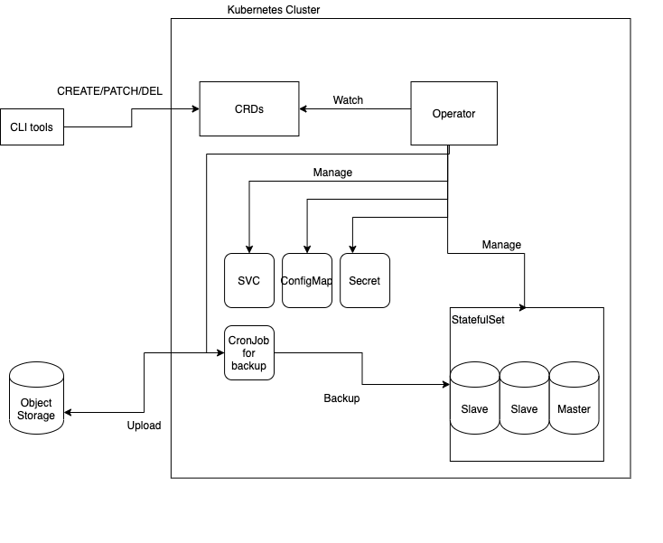

Design notes
============

Motivation
----------

This Kubernetes operator automates operations for the binlog-based replication on MySQL.

InnoDB cluster is widely used for the replication purpose, but we choose not to use InnoDB cluster because it does not allow large (>2GB) transactions.

There are some existing operators which deploy a group of MySQL servers without InnoDB cluster but they does not support the point-in-time-recovery(PiTR) feature.

- [oracle/mysql-operator](https://github.com/oracle/mysql-operator) takes backups only with `mysqldump`
- [presslabs/mysql-operator](https://github.com/presslabs/mysql-operator) does not restore clusters to the state at the desired point-in-time

This operator deploys a group of MySQL servers which replicates data semi-synchronously to the slaves and takes backups with both `mysqlpump` and `mysqlbinlog`.

In this context, we call the group of MySQL servers as MySQL cluster.

Goals
-----

- Avoid losing any data under a given degree of faults.
- Keep the MySQL cluster available under a given degree of faults.
- Perform a quick recovery by combining full backup and binary logs.
- Support all four transaction isolation levels.
- Avoid split-brain.
- Accept large transactions.
- Support multiple MySQL versions and automatic upgrading.
- Support automatic master selection and switchover.
- Support automatic failover.
- Support backups at least once in a day.
- Tenant users can specify the following parameters:
  - The version of MySQL instances.
  - The number of processor cores for each MySQL instance.
  - The amount of memory for each MySQL instance.
  - The amount of backing storage for each MySQL instance.
  - The number of replicas in the MySQL cluster.
  - Custom configuration parameters.
- Allow `CREATE / DROP TEMPORARY TABLE` during a transaction.
- Use Custom Resource Definition(CRD) to automate construction of MySQL database using replication on Kubernetes.

Non-goals
---------

- Support for InnoDB cluster.
- Zero downtime upgrade.
- Node fencing.
- Asynchronous replication between remote data centers.

Components
----------

### Workloads

- Operator: Custom controller which automates MySQL management with the following custom namespaced resources:
  - [`MySQLCluster`](crd_mysql_cluster.md) defines a MySQL cluster.
  - [`MySQLUser`](crd_mysql_user.md) defines a login user in MySQL server.
  - [`MySQLBackupSchedule`](crd_mysql_backup_schedule.md) represents a full dump & binary schedule.
    - [`MySQLDump`](crd_mysql_dump.md) represents a full dump job and contains the file path.
    - [`MySQLBinlog`](crd_mysql_binlog.md) represents a binlog writing job and contains the file path.
  - [`MySQLRestoreJob`](crd_mysql_restore_job.md) represents a Point-in-Time Recovery (PiTR) job.
  - [`MySQLSwitchOverJob`](crd_mysql_switch_over_job.md) represents a switch over job.
- [cert-manager](https://cert-manager.io/): Automate providing client certifications and master-slave certifications.

### External components

- Object storage: Store logical backups and binary logs. It must have Amazon S3 compatible APIs (e.g. Ceph RGW).

### Tools

- `kubectl-myso`: CLI to manipulate MySQL cluster. It provides functionalities such as:
  - Change master manually.
  - Port-forward to MySQL servers.
  - Execute SQL like `mysql -u -p` without credential files.
  - Fetch a credential file to local environment.

### Diagram

Overview of components. This figure is just a draft.

Behaviors
---------

MySO is one of the custom controllers, so it includes custom resource definitions(CRD).

### How to bootstrap MySQL servers

The operator has the responsibility to create master-slave configuration of MySQL clusters.

When the `MySQLCluster` is created, the operator starts deploying a new MySQL cluster as follows.

1. The operator creates StatefulSet which has 3 replicas and its head-less Service.
1. The operator provisions the replicas as 3-node master/slave MySQL servers.
1. The operator creates some k8s resources.
    - Two Services. The first one is for accessing master. The later one is for accessing slaves.
    - Secrets to store credentials.
    - ...

### How to control master-slave configuration

The operator has the responsibility to manage master-slave configuration of MySQL clusters.

The operator stores clusters' states on `MySQLCluster`.
It represents who is the master.

Based on the CR, The operator controls the MySQL servers.

If there is a difference between the desired master defined in `MySQLCluster.spec` and actual master defined in `MySQLCluster.status`,
operator changes the master.
Therefore users can change the master through the CR spec.

### How to failover when a single MySQL instance failure

When the master fails, the cluster is recovered in the following process:
1. Stop the `IO_THREAD` of all slaves
2. Execute master election
3. Configure new master
4. Configure other instances as slaves of the new master
5. Write the new master name to `MySQLCluster.status`
6. Turn off read-only mode on the new master

### How to make a backup

Users can declare the settings of full dump backup with `mysqldump` and binary log backup with `mysqlbinlog` via `MySQLBackupSchedule` CRs. 

- If you create `MySQLBackupSchedule` CR, it creates `CronJob` to make full dump backup and store it in a S3-compatible object storage.
- If you create `MySQLBackupSchedule` CR, it creates `CronJob` to make binlog file to the object storage.

If you want to make backups at once, set `MySQLBackupSchedule.spec.schedules` as run at once.

### How to execute master switchover

Users can execute master switchover via `MySQLCluster` CR using the following field:
- `preferredMasterIndexes`: The array of indexes which instance is preferred as master

### How to perform Point-in-Time-Recovery(PiTR)

PiTR is performed with the following procedure.

1. When we want to perform PiTR, we should create `MySQLRestoreJob` with appropriate settings.
2. The operator sets `MySQLCluster.status.ready` as `false` and makes the MySQL cluster block incoming transactions.
3. The operator makes the MySQL cluster flush binlogs. This binlog is used for recovery if the PiTR fails.
4. The operator lists `MySQLDump` and `MySQLBinlog` candidates based on `MySQLRestoreJob.spec.dumpSelector` and `MySQLRestoreJob.spec.binlogSelector`.
5. The operator selects the `MySQLDump` and `MySQLBinlog` CRs based on `MySQLRestoreJob.spec.pointInTime`.
6.  The operator downloads the dump files and the binlogs from the object storage.
7.  The operator restores the MySQL servers to the state at `MySQLRestoreJob.spec.pointInTime`.
8.  If PiTR finishes successfully, `MySQLRestoreJob.status.succeeded` and `MySQLCluster.status.ready` are set `true`.
    Otherwise, the operator sets `MySQLRestoreJob.status.succeeded` as `false` and tries to recover the state before PiTR.
    If the recovery succeeds, the operator sets `MySQLCluster.status.ready` as `true`.

Note that `MySQLUser` CRs are not restored automatically. If you want the operator to recognize the existing users, `MySQLUser` CRs must be applied again manually (TBD: detail of behavior about consistency between `MySQLUser` and actual user on MySQL).

### How to upgrade MySQL version

MySQL software upgrade is triggered by changing container image specified in `MySQLCluster.spec.podTemplate`.
In this section, the name of `StatefulSet` is assumed to be `mysql`.

1. Switch master to the pod `mysql-0` if the current master is not `mysql-0`.
2. Update and apply `StatefulSet` manifest for `mysql`, to trigger upgrading the slaves:
  - Set `.spec.updateStrategy.rollingUpdate.partition` as one.
  - Set new image version in `.spec.template.spec.containers`.
3. Wait for all the slaves to be upgraded.
4. Switch master to `mysql-1`.
5. Update and apply `StatefulSet` manifest to trigger upgrading `mysql-0`:
  - Remove `.spec.updateStrategy.rollingUpdate.partition`.
6. Wait for the server to be upgraded.

### Candidates of additional features

- Backup files verification
