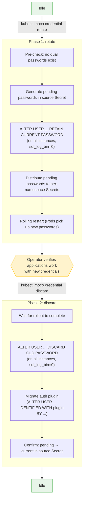

# System User Password Rotation

## Background

MOCO manages 8 system MySQL users (`moco-admin`, `moco-agent`, `moco-repl`, `moco-clone-donor`, `moco-exporter`, `moco-backup`, `moco-readonly`, `moco-writable`).
Their passwords are generated at cluster creation, stored in a controller-managed Secret in the system namespace, and distributed to per-namespace Secrets.
Once generated, these passwords never change.

If a credential leak occurs, the only recovery option today is recreating the cluster.
This design introduces an in-place password rotation mechanism that avoids downtime.

## Goals and Non-goals

**Goals:**

- Rotate all 8 system user passwords without MySQL downtime
- Idempotent and crash-safe (controller restart resumes correctly)
- Prevent accidental propagation of ALTER USER to cross-cluster replicas
- Operator-initiated via `kubectl moco` (no new CRD required)
- Documented manual recovery for every failure mode

**Non-goals:**

- Automatic periodic rotation (build externally with a CronJob)
- Per-user rotation (all 8 users rotate together)
- End-user credential management

## Overview

Password rotation is a **two-phase process** using MySQL's dual password feature (8.0.14+).
The operator explicitly triggers each phase, with a verification window in between.



After Phase 1, both old and new passwords are valid (MySQL dual password).
The operator can verify that applications work with the new credentials before committing to discard the old ones.

## User Interface

```console
# Phase 1
$ kubectl moco credential rotate <cluster-name>

# Phase 2 (after verifying applications work)
$ kubectl moco credential discard <cluster-name>
```

Each command sets an annotation on the MySQLCluster resource that the controller consumes:

| Command | Annotation | Value |
|---------|-----------|-------|
| `rotate` | `moco.cybozu.com/password-rotate` | `<rotationID>` (new UUID) |
| `discard` | `moco.cybozu.com/password-discard` | `<rotationID>` (same UUID from rotate) |

Annotations can also be set directly via `kubectl annotate` for automation.
The CLI is a convenience wrapper that adds validation and user-friendly error messages.

## Key Design Decisions

### Why MySQL Dual Password?

MySQL 8.0.14+ allows a user to have two valid passwords simultaneously:

```sql
-- After this, both old and new passwords are accepted
ALTER USER 'user'@'%' IDENTIFIED BY 'new' RETAIN CURRENT PASSWORD;

-- After this, only the new password is accepted
ALTER USER 'user'@'%' DISCARD OLD PASSWORD;
```

MySQL holds only one secondary password per user.
A second RETAIN overwrites the secondary slot, which is why we must prevent double-execution (see [Crash Safety](#crash-safety)).

### Why `sql_log_bin=0`?

MOCO supports cross-cluster replication.
ALTER USER is a DDL written to the binary log.
If propagated, a downstream cluster would receive the upstream's passwords, breaking its own credentials.

All ALTER USER operations use `SET sql_log_bin=0` (session-scoped, via a dedicated `db.Conn`) to suppress binlog writes.
As a consequence, within-cluster replicas also do not receive the change via replication, so the controller executes ALTER USER on **every instance individually**.

### Why Auth Plugin Migration Is in Phase 2?

MySQL Error 3894 prevents changing the authentication plugin in a `RETAIN CURRENT PASSWORD` statement.
Instead, plugin migration happens after DISCARD in Phase 2 using `ALTER USER ... IDENTIFIED WITH <plugin> BY ...`.

The target plugin is determined from `@@global.authentication_policy` on the primary instance:
- If the first element is a concrete plugin name (e.g. `caching_sha2_password`): use it
- If the first element is `*` or empty: default to `caching_sha2_password`

This enables transparent migration from legacy plugins like `mysql_native_password` during rotation.

### Why the Controller (Not ClusterManager)?

Password rotation is a **state-driven lifecycle operation** with persistent phases stored in `MySQLCluster.Status`.
This matches the controller's reconciliation pattern, not the clusterManager's transient operational tasks (switchover, failover, replica configuration).

## Internal Phase Tracking

The controller tracks progress in `.status.systemUserRotation`:

```go
type SystemUserRotationStatus struct {
    RotationID     string        // UUID of the current rotation cycle
    Phase          RotationPhase // Idle, Rotating, or Rotated
    RotateApplied  bool          // ALTER USER RETAIN completed on all instances?
    DiscardApplied bool          // DISCARD OLD PASSWORD completed on all instances?
    LastRotationID string        // UUID of the last completed cycle (for stale detection)
}
```

## Phase 1: Rotate (`handlePasswordRotate`)

| Step | Action | Persistence |
|------|--------|-------------|
| 0 | Pre-check: scan all instances for pre-existing dual passwords. Refuse if found. | - |
| 1 | Set Phase=Rotating with the rotationID from the annotation | Status.Patch |
| 2 | Generate `*_PENDING` passwords in the source Secret | Secret.Update |
| 3 | For each instance: ALTER USER ... RETAIN CURRENT PASSWORD (with `sql_log_bin=0`) | MySQL |
| 4 | Set RotateApplied=true | Status.Patch |
| 5 | Distribute pending passwords to per-namespace Secrets | Secret.Apply |
| 6 | Set Phase=Rotated | Status.Patch |
| 7 | Remove the `password-rotate` annotation (best-effort) | Patch |

**Instance loop (Step 3):**
Instances are processed sequentially (ordinal 0, 1, 2, ...).
For each instance:

1. Connect using the current (old) password
2. For replicas: temporarily disable `super_read_only`
3. For each user: check `HasDualPassword` → skip if already applied, else execute RETAIN
4. For replicas: re-enable `super_read_only` (best-effort; the clustering loop recovers)

If any instance is unreachable, the reconcile returns an error and retries.

**Rolling restart:**
When Phase transitions to Rotated, a Pod template annotation (`moco.cybozu.com/password-rotation-restart: <rotationID>`) is added to the StatefulSet, triggering a rolling restart so the agent sidecar picks up the new passwords via `EnvFrom`.

**Scaled-down clusters (replicas=0):**
Rotation is refused with a Warning Event (`RotateRefused`).
Without running instances, ALTER USER cannot execute, and distributing new passwords would break connectivity when the cluster scales back up.

## Phase 2: Discard (`handlePasswordDiscard`)

| Step | Action | Persistence |
|------|--------|-------------|
| 0 | Validate: Phase=Rotated, RotateApplied=true, pending passwords exist | - |
| 0b | Wait for StatefulSet rollout to complete | - |
| 0c | Determine target auth plugin via `GetAuthPlugin` on the primary | MySQL (read-only) |
| 1 | For each instance: DISCARD OLD PASSWORD + auth plugin migration (with `sql_log_bin=0`) | MySQL |
| 2 | Set DiscardApplied=true | Status.Patch |
| 3 | Confirm pending passwords: copy `*_PENDING` → current, delete pending keys | Secret.Update |
| 4 | Reset status to Idle, save LastRotationID | Status.Patch |
| 5 | Remove both annotations (best-effort) | Patch |

**Why wait for the rollout (Step 0b)?**
The agent sidecar reads passwords from `EnvFrom`, evaluated only at Pod startup.
If old Pods are still running when DISCARD executes, they lose connectivity.
The gate checks: ObservedGeneration, CurrentRevision == UpdateRevision, UpdatedReplicas == Replicas, ReadyReplicas == Replicas.
While waiting, the handler returns `RequeueAfter: 15s` (not an error) to avoid log spam.

**Why connect with the pending password?**
DISCARD removes the old password.
If we connected with the old password, the connection would become invalid immediately after DISCARD succeeds.
Using the pending password also implicitly verifies that distribution was successful.

**Scaled-down clusters (replicas=0):**
Discard is rejected with a Warning Event (`DiscardRefused`) and `RequeueAfter: 15s`.
The operator should scale the cluster up first.

## Crash Safety

### HasDualPassword Instead of Per-User Status Tracking

MySQL holds only one secondary password per user.
If the controller re-runs RETAIN with the same pending password after a crash, the pending password (now the primary) moves into the secondary slot, evicting the original password.
The controller can no longer connect.

Instead of tracking per-user progress in Kubernetes status (which can fail independently of MySQL), the controller queries MySQL directly: if `mysql.user.User_attributes` contains `additional_password`, RETAIN is skipped.
This makes MySQL the source of truth and is safe on re-reconcile because the query is read-only.

### Idempotency of DISCARD

`DISCARD OLD PASSWORD` is idempotent in MySQL (no-op when there is no secondary password), so per-user tracking is not needed.

### ConfirmPendingPasswords Idempotency

A crash between Secret.Update and Status.Patch leaves the Secret already confirmed but DiscardApplied=true in status.
On re-reconcile, Confirm finds no pending keys and returns nil.

### Stale Annotation Detection

After a completed cycle, the best-effort annotation removal may fail.
Without detection, the next reconcile would start a spurious new rotation.

The controller compares the annotation's rotationID with `LastRotationID`:
- **Match**: stale annotation → remove silently
- **Mismatch**: fresh trigger → proceed with rotation

### Precondition-Not-Met Handling for Discard

If `password-discard` is set but Phase != Rotated or RotateApplied != true:
1. The annotation is consumed (removed)
2. A Warning Event (`DiscardSkipped`) is emitted
3. The user can re-apply after completing Phase 1

## Interaction with Other Reconcile Steps

### reconcileV1Secret

`reconcileV1Secret` runs before password rotation in the reconcile loop.
During rotation (Phase != Idle), it returns early without distributing — the rotation handler owns distribution.
After discard completes and Phase resets to Idle, the source Secret already contains confirmed passwords, so normal distribution works correctly.

### Rotate and Discard Never Run in the Same Reconcile

If both annotations are present, rotate runs first and returns immediately.
Discard is evaluated on the next reconcile, preserving the verification window.

## Source Secret Layout

During rotation, the source Secret holds both current and pending passwords:

```
ADMIN_PASSWORD:         <current>
AGENT_PASSWORD:         <current>
...
ADMIN_PASSWORD_PENDING: <new>       # only during rotation
AGENT_PASSWORD_PENDING: <new>       # only during rotation
...
ROTATION_ID:            <uuid>      # only during rotation
```

`HasPendingPasswords` validates that all 8 `*_PENDING` keys and `ROTATION_ID` are present and match the expected rotation ID.
Partial or mismatched state is treated as an error.

## Assumptions

No MOCO system user has a dual password when rotation starts.
The controller checks this at Phase=Idle using `HasDualPassword` across all instances and all users.
If a stale dual password is found, rotation is refused with a `DualPasswordExists` Warning Event.
See [Recovery: Dual Password Exists While Phase=Idle](#dual-password-exists-while-phaseidle).

## Security Considerations

- `RotateUserPassword`, `DiscardOldPassword`, and `MigrateUserAuthPlugin` interpolate user names directly into SQL (MySQL does not support placeholders for `ALTER USER`). User names are always from the fixed constants in `pkg/constants/users.go`.
- `MigrateUserAuthPlugin` interpolates the plugin name into `IDENTIFIED WITH`. The value is validated against `^[a-zA-Z0-9_]+$` and derived from `@@global.authentication_policy`, never from user input.
- All ALTER USER operations use `SET sql_log_bin=0` via a dedicated `db.Conn` to prevent cross-cluster propagation.

## Recovery Procedures

All recovery procedures follow the same principle: **reset MySQL passwords back to the current (old) values known to the controller**.
The key insight is that `ALTER USER ... IDENTIFIED BY` (without RETAIN) sets the primary password and clears any secondary, restoring MySQL to a clean single-password state.

### Common Recovery Steps

The three failure scenarios below share common recovery steps. The differences are noted in each section.

<a id="reset-mysql-passwords"></a>

#### How to Reset MySQL Passwords

Retrieve the current passwords from the source Secret:

```console
$ kubectl -n <system-namespace> get secret <controller-secret-name> \
    -o jsonpath='{.data.ADMIN_PASSWORD}' | base64 -d
# Repeat for: AGENT_PASSWORD, REPLICATION_PASSWORD, CLONE_DONOR_PASSWORD,
# EXPORTER_PASSWORD, BACKUP_PASSWORD, READONLY_PASSWORD, WRITABLE_PASSWORD
```

Identify which instance is the primary:

```console
$ kubectl -n <namespace> exec <pod> -c mysqld -- \
    mysql -u moco-admin -p<admin-password> \
    -e "SELECT @@read_only, @@super_read_only;"
# primary: read_only=0, super_read_only=0
# replica: read_only=1, super_read_only=1
```

Execute on the **primary**:

```console
$ kubectl -n <namespace> exec <primary-pod> -c mysqld -- \
    mysql -u moco-admin -p<admin-password> -e "
  SET SESSION sql_log_bin=0;
  ALTER USER 'moco-admin'@'%' IDENTIFIED BY '<admin-password>';
  ALTER USER 'moco-agent'@'%' IDENTIFIED BY '<agent-password>';
  ALTER USER 'moco-repl'@'%' IDENTIFIED BY '<repl-password>';
  ALTER USER 'moco-clone-donor'@'%' IDENTIFIED BY '<clone-donor-password>';
  ALTER USER 'moco-exporter'@'%' IDENTIFIED BY '<exporter-password>';
  ALTER USER 'moco-backup'@'%' IDENTIFIED BY '<backup-password>';
  ALTER USER 'moco-readonly'@'%' IDENTIFIED BY '<readonly-password>';
  ALTER USER 'moco-writable'@'%' IDENTIFIED BY '<writable-password>';
"
```

Execute on **each replica** (includes `super_read_only` handling):

```console
$ kubectl -n <namespace> exec <replica-pod> -c mysqld -- \
    mysql -u moco-admin -p<admin-password> -e "
  SET SESSION sql_log_bin=0;
  SET GLOBAL super_read_only=OFF;
  ALTER USER 'moco-admin'@'%' IDENTIFIED BY '<admin-password>';
  ALTER USER 'moco-agent'@'%' IDENTIFIED BY '<agent-password>';
  ALTER USER 'moco-repl'@'%' IDENTIFIED BY '<repl-password>';
  ALTER USER 'moco-clone-donor'@'%' IDENTIFIED BY '<clone-donor-password>';
  ALTER USER 'moco-exporter'@'%' IDENTIFIED BY '<exporter-password>';
  ALTER USER 'moco-backup'@'%' IDENTIFIED BY '<backup-password>';
  ALTER USER 'moco-readonly'@'%' IDENTIFIED BY '<readonly-password>';
  ALTER USER 'moco-writable'@'%' IDENTIFIED BY '<writable-password>';
  SET GLOBAL super_read_only=ON;
"
```

> `sql_log_bin=0` must be set before disabling `super_read_only` to prevent intermediate writes from being logged.
> MOCO's clustering loop will re-enable `super_read_only` automatically if the manual re-enable fails.

---

### Stale Pending Passwords (RotationID Mismatch)

**Symptom:** Warning Event `RotationPendingError`

**Cause:** A previous rotation was interrupted, leaving `*_PENDING` and `ROTATION_ID` from a different rotation cycle in the source Secret.
This typically happens when the status was manually reset to Idle while the Secret still contains pending data.

**Why this needs MySQL cleanup:**
The interrupted rotation may have partially executed RETAIN on some instances.
Without cleanup, a new rotation would see `HasDualPassword=true` on those instances, skip RETAIN, and leave them with stale passwords — causing connectivity loss after DISCARD.

**Recovery order: status → Secret → rollout → MySQL**

This ordering is critical. At this point, some Pods may be running with new (pending) passwords.
MySQL still accepts both via dual password.
If MySQL were reset first, Pods with new passwords would immediately lose connectivity.
By resetting status and Secret first, Pods are rolled back to old passwords before MySQL clears the dual-password state.

```console
# Step 1: Reset rotation status to Idle.
# This unblocks reconcileV1Secret to re-distribute old passwords
# and triggers a rolling restart via StatefulSet template update.
$ kubectl edit mysqlcluster <name>
# Set in status.systemUserRotation:
#   phase: ""
#   rotationID: ""
#   rotateApplied: false
#   discardApplied: false
# Leave lastRotationID unchanged.

# Step 2: Clean the source Secret.
$ kubectl -n <system-namespace> edit secret <controller-secret-name>
# Delete all *_PENDING keys and ROTATION_ID

# Step 3: Wait for all Pods to restart with old passwords.
$ kubectl -n <namespace> rollout status statefulset <cluster-name>

# Step 4: Reset MySQL passwords on all instances.
# See "How to Reset MySQL Passwords" above.
```

### Missing Pending Passwords During Discard

**Symptom:** Warning Event `MissingRotationPending`

**Cause:** The source Secret lost its pending keys (manual edit, restore from backup, etc.) while status still shows Rotated.

**Why this is dangerous:**
At Phase=Rotated, all instances hold dual passwords and Pods may be using the pending passwords.
The pending passwords are irrecoverable (MySQL stores only hashes).
Without recovery, dual-password state persists indefinitely and blocks future rotations.

**Recovery:** Same as stale pending passwords — reset status → Secret → rollout → MySQL.

```console
# Step 1: Reset rotation status to Idle.
$ kubectl edit mysqlcluster <name>
# Set in status.systemUserRotation:
#   phase: ""
#   rotationID: ""
#   rotateApplied: false
#   discardApplied: false
# Leave lastRotationID unchanged.

# Step 2: Clean any remaining pending keys from the source Secret.
$ kubectl -n <system-namespace> edit secret <controller-secret-name>
# Delete any remaining *_PENDING keys and ROTATION_ID

# Step 3: Wait for all Pods to restart with old passwords.
$ kubectl -n <namespace> rollout status statefulset <cluster-name>

# Step 4: Reset MySQL passwords on all instances.
# See "How to Reset MySQL Passwords" above.
```

### Dual Password Exists While Phase=Idle

**Symptom:** Warning Event `DualPasswordExists`

**Cause:** A MOCO system user has `additional_password` set while rotation status is Idle.
This happens when a previous recovery didn't fully clear MySQL's dual-password state, or someone ran `ALTER USER ... RETAIN CURRENT PASSWORD` manually.

**Why DISCARD OLD PASSWORD must not be used:**
After RETAIN, the primary is the new (potentially unknown) password and the secondary is the old (known) password.
DISCARD removes the secondary, leaving only the unknown primary — breaking connectivity.

**Recovery:** No status or Secret reset needed (already Idle, no pending keys).

```console
# Step 1 (recommended): Verify Pods can connect with current credentials.

# Step 2 (recommended): Wait for any in-progress rollout.
$ kubectl -n <namespace> rollout status statefulset <cluster-name>

# Step 3: Reset MySQL passwords on all instances.
# See "How to Reset MySQL Passwords" above.

# After recovery, retry: kubectl moco credential rotate <name>
```
